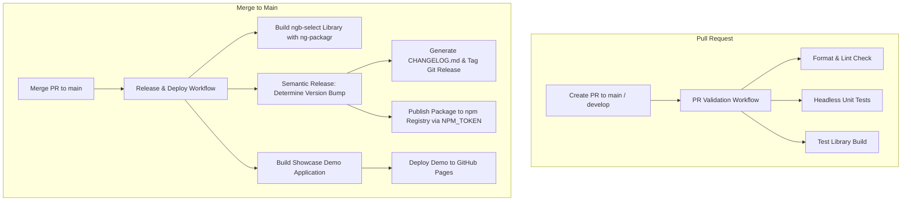

# 05. CI/CD Pipeline and NPM Package Automation

> **Note**: For a step-by-step release reference, see the **[Publishing Guide](./PUBLISHING-GUIDE.md)**.

This guide outlines the end-to-end setup for registering `ngb-select` as an official package on the [npm Registry](https://www.npmjs.com) and orchestrating automated versioning, publishing, and demo application deployments using **GitHub Actions** and **Semantic Release**.

---

## Workflow Architecture



---

## 1. NPM Package Registration & Setup

### Step 1: Create an NPM Account & Scope (Optional)

1. Sign up or log in at [npmjs.com](https://www.npmjs.com/).
2. If publishing under an organization scope (e.g. `@my-org/ngb-select`):
   - Go to your profile menu > **Add Organization**.
   - Create your organization.

### Step 2: Generate an NPM Access Token

1. In your NPM account, navigate to **Access Tokens** (`https://www.npmjs.com/settings/<username>/tokens`).
2. Click **Generate New Token** and choose either:
   - **Granular Access Token** (Recommended): Select **Read and Write** packages permissions and restrict to the package or organization.
   - **Classic Automation Token**: Bypasses 2FA during automated CI runs.
3. Copy the generated token string.

### Step 3: Add NPM Token to GitHub Secrets

1. In your GitHub repository, navigate to **Settings > Secrets and variables > Actions**.
2. Click **New repository secret**.
3. Name: `NPM_TOKEN`
4. Value: Paste your NPM token.

### Step 4: Library `package.json` Configuration

Inside the library package directory (`projects/ngb-select/package.json`), ensure metadata and publishing flags are set:

```json
{
  "name": "ngb-select",
  "version": "0.0.1",
  "description": "Lightweight, accessible, standalone Angular Select dropdown component built with pure Bootstrap 5",
  "keywords": [
    "angular",
    "angular-select",
    "bootstrap",
    "bootstrap-5",
    "select",
    "dropdown",
    "combobox",
    "standalone",
    "ngb-select"
  ],
  "license": "MIT",
  "publishConfig": {
    "access": "public"
  },
  "peerDependencies": {
    "@angular/common": ">=18.0.0",
    "@angular/core": ">=18.0.0",
    "@angular/forms": ">=18.0.0",
    "bootstrap": ">=5.0.0"
  },
  "peerDependenciesMeta": {
    "bootstrap": {
      "optional": true
    }
  },
  "dependencies": {
    "tslib": "^2.3.0"
  },
  "sideEffects": false
}
```

---

## 2. Semantic Release Configuration (`.releaserc.json`)

Semantic Release analyzes git commit messages using **Conventional Commits** to automatically compute the next semantic version, generate release notes, and publish the package.

Create `.releaserc.json` in the root repository:

```json
{
  "branches": [
    "main",
    { "name": "beta", "prerelease": true },
    { "name": "next", "prerelease": true }
  ],
  "plugins": [
    "@semantic-release/commit-analyzer",
    "@semantic-release/release-notes-generator",
    [
      "@semantic-release/changelog",
      {
        "changelogFile": "CHANGELOG.md"
      }
    ],
    [
      "@semantic-release/npm",
      {
        "pkgRoot": "dist/ngb-select"
      }
    ],
    [
      "@semantic-release/git",
      {
        "assets": ["package.json", "CHANGELOG.md"],
        "message": "chore(release): ${nextRelease.version} [skip ci]\n\n${nextRelease.notes}"
      }
    ],
    "@semantic-release/github"
  ]
}
```

### How Commit Types Trigger Releases

| Commit Format                              | Example                                         | SemVer Bump                                 |
| :----------------------------------------- | :---------------------------------------------- | :------------------------------------------ |
| `fix(...)`                                 | `fix(dropdown): resolve overlay clipping issue` | **Patch** (`v1.0.0` $\rightarrow$ `v1.0.1`) |
| `feat(...)`                                | `feat(filter): add filterMatchMode options`     | **Minor** (`v1.0.0` $\rightarrow$ `v1.1.0`) |
| `BREAKING CHANGE:`                         | `feat(api)!: rename optionKey to dataKey`       | **Major** (`v1.0.0` $\rightarrow$ `v2.0.0`) |
| `docs(...)`, `chore(...)`, `refactor(...)` | `docs(readme): add installation guide`          | **No release**                              |

---

## 3. GitHub Actions Workflows

### 3.1. PR Validation Workflow (`.github/workflows/pr-checks.yml`)

Executes on every pull request targeting `main` or `develop` branches:

```yaml
name: PR Validation Checks

on:
  pull_request:
    branches: [main, develop]

jobs:
  validate:
    runs-on: ubuntu-latest
    strategy:
      matrix:
        node-version: [20.x, 22.x]

    steps:
      - name: Checkout Code
        uses: actions/checkout@v4

      - name: Setup Node.js ${{ matrix.node-version }}
        uses: actions/setup-node@v4
        with:
          node-version: ${{ matrix.node-version }}
          cache: 'npm'

      - name: Install Dependencies
        run: npm ci

      - name: Enforce Code Formatting
        run: npm run prettier:check

      - name: Run Unit Tests
        run: npm run test -- --no-watch --browsers=ChromeHeadless

      - name: Verify Library Build
        run: npm run build:lib
```

---

### 3.2. Automated Release & Deployment Workflow (`.github/workflows/deploy.yml`)

Executes upon merging pull requests into `main`:

```yaml
name: Release and Deploy

on:
  push:
    branches:
      - main

jobs:
  release:
    name: Build, Release & Publish
    runs-on: ubuntu-latest
    permissions:
      contents: write
      issues: write
      pull-requests: write
      id-token: write

    steps:
      - name: Checkout Repository
        uses: actions/checkout@v4
        with:
          fetch-depth: 0

      - name: Setup Node.js
        uses: actions/setup-node@v4
        with:
          node-version: '20.x'
          cache: 'npm'
          registry-url: 'https://registry.npmjs.org'

      - name: Install Dependencies
        run: npm ci

      - name: Build ngb-select Library
        run: npm run build:lib

      - name: Run Semantic Release & Publish to NPM
        env:
          GITHUB_TOKEN: ${{ secrets.GITHUB_TOKEN }}
          NPM_TOKEN: ${{ secrets.NPM_TOKEN }}
          NODE_AUTH_TOKEN: ${{ secrets.NPM_TOKEN }}
        run: npx semantic-release

      - name: Build Demo Application
        run: npm run build:demo -- --base-href=/ngb-select/

      - name: Deploy Demo to GitHub Pages
        uses: peaceiris/actions-gh-pages@v3
        with:
          github_token: ${{ secrets.GITHUB_TOKEN }}
          publish_dir: ./dist/ngb-select-app/browser
```

---

## 4. GitHub Repository Configuration

### 4.1. Branch Protection Rules

Navigate to **Settings > Branches > Add branch protection rule**:

- **Branch pattern:** `main`
- **Require a pull request before merging:** Enabled
- **Require status checks to pass before merging:** Enabled (Select `PR Validation Checks`)

### 4.2. GitHub Pages Configuration

Navigate to **Settings > Pages**:

- **Build and deployment source:** `Deploy from a branch`
- **Branch:** `gh-pages` / `/ (root)`

---

## 5. Verification & Testing Releases

- **Dry-run semantic release locally:**
  ```bash
  npx semantic-release --dry-run
  ```
- **Inspect build artifacts:**
  ```bash
  npm run build:lib
  ls dist/ngb-select
  ```
- **Verify package contents before publishing:**
  ```bash
  cd dist/ngb-select && npm pack --dry-run
  ```
